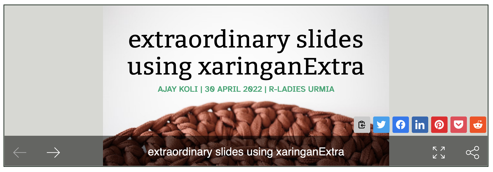
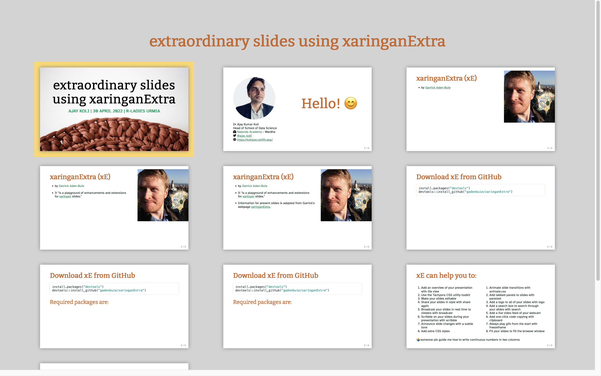

```{r setup, echo=FALSE}

knitr::opts_chunk$set(echo = F,
                      fig.align = 'center',
                      message = F,
                      warning = F)

```

```{r pkgs}
library(xaringan)
library(tidyverse)
library(palmerpenguins)
library(kableExtra)
library(emo)
library(RColorBrewer)
library(metathis)
library(xaringanExtra)
xaringanExtra::use_tile_view()
xaringanExtra::use_panelset()
xaringanExtra::use_tachyons()
xaringanExtra::use_share_again()
xaringanExtra::use_clipboard()
```

```{r}
meta() %>%
  meta_general(
    description = "Ajay Koli - Nalanda Academy",
    generator = "xaringan and remark.js"
  ) %>% 
  meta_name("github-repo" = "koliajaykr/xarExtra-session") %>% 
  meta_social(
    title = "extraordinary slides using xaringanExtra",
    url = "https://xeurmia.netlify.app/",
    image = "https://xeurmia.netlify.app/images/social-card.png",
    og_type = "talk",
    og_author = "Ajay Koli",
    twitter_card_type = "summary_large_image",
    twitter_creator = "@ajay_kolii"
  ) %>%
  include_meta()
```

background-image: url("https://images.unsplash.com/photo-1560347964-838d2f63cdc0?ixlib=rb-1.2.1&ixid=MnwxMjA3fDB8MHxwaG90by1wYWdlfHx8fGVufDB8fHx8&auto=format&fit=crop&w=1771&q=80")
background-size: cover
background-position: 

class: title-slide, hide-count, center hide-logo

# .black[`r rmarkdown::metadata$title`]

## .green.b[Ajay Koli | `r format(Sys.Date(), '%e %B, %Y')` | R-Ladies Urmia]

---

class: middle, hide-logo

```{r}
xaringanExtra::use_logo(image_url = "https://pbs.twimg.com/profile_images/1399612666847674369/O6F5fplU_400x400.jpg",
                        link_url = "https://twitter.com/RLadiesUrmia?ref_src=twsrc%5Egoogle%7Ctwcamp%5Eserp%7Ctwgr%5Eauthor",
                        width = "70px",
                        height = "70px")
```


.pull-left[
```{r , echo=FALSE, out.width="70%", fig.align='left'}

 
# `r format(Sys.Date(), "%d %B %Y") 
# <i class="fab fa-r-project"></i>
```

Dr Ajay Kumar Koli<br>Head of School of Data Science<br>`r icons::fontawesome("briefcase")` [Nalanda Academy](https://nalanda-academy.org/) - Wardha, India
<br>`r icons::fontawesome("globe")` [https://koliajay.netlify.app/](https://koliajay.netlify.app/)<br>`r icons::fontawesome("envelope")` [koliajaykumar@gmail.com](koliajaykumar@gmail.com)<br>`r icons::fontawesome("twitter")` [@ajay_kolii](https://twitter.com/ajay_kolii)
]

.pull-right[
<br>
<br>
<br>
<br>
# .big-text[Hello! `r emo::ji("blush")`]

]

---

class: center middle

# `r emo::ji("dart")` .green.underline[GOAL] `r emo::ji("dart")`

```{r out.width="100%", fig.align='center'}

```

---

background-image: url("images/xaringan.png")
background-size: 35%
background-position: 50% 65%

# xaringan `r emo::ji("fencer")`

- "The xaringan package is an R Markdown extension based on the JavaScript library remark.js to generate HTML5 presentations of a different style."

.footnote[
Source: xaringan book [chapter](https://bookdown.org/yihui/rmarkdown/xaringan.html)
]

---

# Basics of xaringan

- to add a new slide: `---`

--

- for increment slide: `--`

--

- two columns: `.pull-left[]` & `.pull-right[]`

--

- `class: center, inverse, hide-count, hide-logo`

--

- text size:
  - `# heading`
  - `## sub-heading`
  - `### sub-sub-heading`

---

background-image: url("https://avatars.githubusercontent.com/u/5420529?v=4")
background-size: 30%
background-position: 101% 0%

class: hide_logo

# `r emo::ji("ferris_wheel")` xaringanExtra (xE)

- by [Garrick Aden-Buie](https://www.garrickadenbuie.com/)

--

- It "is a playground of enhancements and extensions <br>for [xaringan](https://slides.yihui.org/xaringan/#1) slides."

--

- Information for the present slides is adapted from <br>Garrick's webpage [xaringanExtra]((https://pkg.garrickadenbuie.com/xaringanExtra/#/).

---

# Download xE from GitHub

```{r eval=FALSE, echo=TRUE}
install.packages("devtools")
devtools::install_github("gadenbuie/xaringanExtra")
```

--

## Required packages are:

```{r eval=FALSE, echo=TRUE}
library(xaringan)
library(xaringanExtra)
library(palmerpenguins) # to get penguins data
library(kableExtra) # to prepare tables
library(metathis) # to prepare social card
```

---

# `r emo::ji("star_struck")` xE can help you to:

.pull-left[
- Add an overview of your presentation with tile view
- Use the Tachyons CSS utility toolkit
- Make your slides editable
- Share your slides in style with share again
- Broadcast your slides in real time to viewers with broadcast
- Scribble on your slides during your presentation with scribble
- Announce slide changes with a subtle tone
- Add extra CSS styles
]

.pull-right[
- Animate slide transitions with animate.css
- Add tabbed panels to slides with panelset
- Add a logo to all of your slides with logo
- Add a search box to search through your slides with search
- Add a live video feed of your webcam
- Add one-click code copying with clipboard
- Always play gifs from the start with freezeframe
- Fit your slides to fill the browser window
]

---

# Slide overview

```{r echo=TRUE, eval=FALSE}
xaringanExtra::use_tile_view()
```

```{r tile-pic}

```

---

# Tachyons

```{r echo=FALSE, eval=FALSE}
xaringanExtra::use_tachyons()
```

- a collection of `CSS` utility classes (check this website http://tachyons.io/ for a list of functions)

--

- color of the text `.nameofthecolor[your text]`

  - `.silver[I am red!]` = .silver[I am silver.]
  - `.gold[I am red!]` = .gold[Your are gold.]
  
--

- italicize text `.i[write text here]`

  - `.i[Allow me to tilt a bit]` = .i[Allow me to tilt a bit]  
  
--

- bold text `.b[Bold & Beautiful.]` = .b[Bold & Beautiful.]

- underline text `.underline[This is important.]` = .underline[This is important]

- strike text `.strike[This was by mistake.]` = .strike[This was by mistake.]

---

# Combine tachyons

- .b.underline.blue[This is just fantastic.] = `.b.underline.blue[This is just fantastic.]`

--

- `.b.blue[this is .red[awesome] .strike[but fake]]` = .b.blue[this is .red[awesome] .strike[but fake]]

--

- Text size
  - `.f1[hello]` = .f1[hello] 
  - `.f2[hello]` = .f2[hello] 
  - `.f3[hello]` = .f3[hello]
  - `.f4[hello]` = .f4[hello]
  - `.f5[hello]` = .f5[hello]

--

- Capital Text `.ttc[nice thing to say]` = .ttc[nice thing to say]

--

- UPPER-CASE TEXT `.ttu[we all are tall]` = .ttu[we all are tall]

---


# Combine tachyons

.bg-washed-yellow.b--dark-blue.ba.bw2.br3.shadow-5.ph4.mt5[
The only way to write good code is to write tons of bad code first. 
Feeling shame about bad code stops you from getting to good code

.tr[
— Hadley Wickham
]]

`.bg-washed-yellow.b--dark-blue.ba.bw2.br3.shadow-5.ph4.mt5[
The only way to write good code is to write tons of bad code first. Feeling shame about bad code stops you from getting to good code
.tr[
— Hadley Wickham
]]`

---

# Clipboard

```{r eval=FALSE, echo=TRUE}
xaringanExtra::use_clipboard(
  #button_text = "Copy code from here",
  #success_text = "Done",
)
```

---

# Progress bar

```{r echo=TRUE}
xaringanExtra::use_progress_bar(color = "#800080", 
                                location = "top",
                                height = "0.25em")
```

---

# Panelset

```{r eval=FALSE, echo=TRUE}
xaringanExtra::use_panelset()
```

--

.panelset[
.panel[.panel-name[Panel 1]
## We can place our content here

- you can write panel name as you like

- it is very helpful while showing simultaneously code and its output

- use $\leftarrow$ left and $\rightarrow$ right arrow keys to move from one panel to another
]

.panel[.panel-name[Image]
```{r out.width="45%"}
knitr::include_graphics("https://i.giphy.com/media/OFIsBxe3v7mKI/giphy.webp")
```

]

.panel[.panel-name[Panel 3]
```{r}
penguins %>%
  head() %>% 
  kbl() %>% 
  kable_styling()
```

]

.panel[.panel-name[Plot Code]
```{r plot-code, echo=TRUE, eval=FALSE}
penguins %>% 
  ggplot(aes(bill_length_mm, bill_depth_mm)) +
  geom_point(aes(color = species)) +
  scale_color_brewer(palette = "Dark2") +
  theme_bw() +
  labs(
    title = "Relationship between bill length and depth of the palmer penguins",
    x = "Bill length (mm)",
    y = "Bill depth (mm)"
      ) +
  theme(text = element_text(size = 12))
```
]

.panel[.panel-name[Plot]
```{r ref.label="plot-code", out.width="100%", fig.width=12, fig.height=4, fig.retina=3}

```
]
]

---

# Logo

- add logo to each slide

```{r xaringan-logo, eval=FALSE, echo=TRUE}
xaringanExtra::use_logo(
image_url = "https://pbs.twimg.com/profile_images/1399612666847674369/O6F5fplU_400x400.jpg",
link_url = "https://twitter.com/RLadiesUrmia?ref_src=twsrc%5Egoogle%7Ctwcamp%5Eserp%7Ctwgr%5Eauthor",
width = "70px",
height = "70px"))
```

---

# Highlight code

- `#<<` to highlight the code

```{r echo=TRUE}
xaringanExtra::use_extra_styles(
  hover_code_line = TRUE,         #<<
  mute_unhighlighted_code = TRUE  #<<
)
```

---

# Share again

- To share your xaringan slides

```{r echo=TRUE, eval=FALSE}
xaringanExtra::use_share_again()
```

```{r}
xaringanExtra::embed_xaringan(url = "https://xeurmia.netlify.app/#1", ratio = 3:1)
```

---
## Social card
````
```{r echo = T}
meta() %>%
  meta_general(
    description = "Ajay Koli - Nalanda Academy",
    generator = "xaringan and remark.js"
  ) %>% 
  meta_name("github-repo" = "koliajaykr/xarExtra-session") %>% 
  meta_social(
    title = "extraordinary slides using xaringanExtra",
    url = "https://xeurmia.netlify.app/",
    image = "https://xeurmia.netlify.app/images/social-card.png",
    og_type = "talk",
    og_author = "Ajay Koli",
    twitter_card_type = "summary_large_image",
    twitter_creator = "@ajay_kolii"
  ) %>%
  include_meta()
```
````

---

# Embed 

```{r echo=TRUE}
xaringanExtra::embed_xaringan(url="https://xeurmia.netlify.app/#1",
                              ratio = 3:1)
```

---

class: center middle hide_logo

.pull-left[
<br>
<br>
<br>
# Thank you!!

# Yalda and Nasrin
]

.pull-right[
```{r}
knitr::include_graphics("https://pbs.twimg.com/profile_images/1399612666847674369/O6F5fplU_400x400.jpg")
```
]
